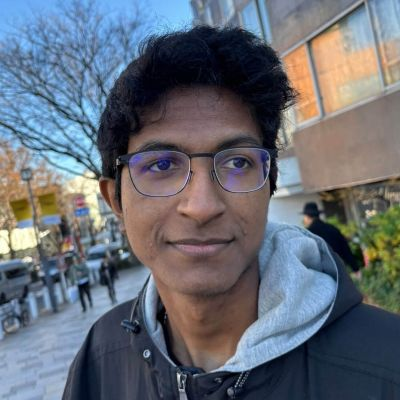

# Niroop Krishnakumar's Site

## Table of Contents
* [About Me](#about-me)
* [Research Projects (RSRI)](#research-projects-rsri)
* [Links and Contacts](#links-and-contacts)

## About Me
I'm a 2nd year CS major at UC San Diego. \
 \
My favorite hobbies are: 
1. Video Games
2. Tennis
3. Art

My current goals include:
- [ ] Pass my classes
- [ ] Get an internship
- [ ] Get rid of this lingering cough!!!

Lastly, here's a random inspirational quote:
> *"Believe you can and you're halfway there"* - Theodore Roosevelt

## Research Projects (RSRI)
Worked with Professor Jhala and another Regents scholar on the following projects:
* **Wishlist** - A basic wishlist application (self-explanatory)
* **Voltron** - An application that groups students up and allows them to share code in a buffer
* **Course** - A general application that teachers and their students can use for their course
* **Conf** - An application for creating and viewing research papers

It was done using the Rust programming language and the Rocket framework. Here's a code snippet:
```
#[get("/home")]
pub fn home() -> Template {
    Template::render("home",  context!{})
}
```

[Image of Wishlist Frontend (Demo)](images/wishlist.png)

## Links and Contacts
Github: [https://github.com/niroopkris](https://github.com/niroopkris) \
Email: [niroopkris@gmail.com](mailto:niroopkris@gmail.com)


